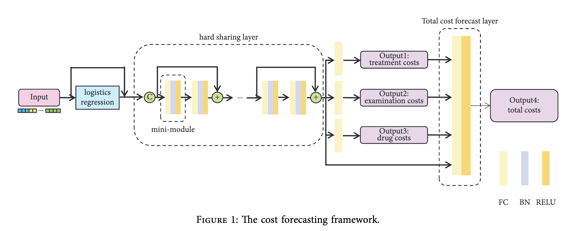

# Papers

## Explainable AI for medical cost prediction

[Machine Learning For An Explainable Cost Prediction of Medical Insurance](https://api.semanticscholar.org/CorpusId:265443763) 
---
Predictive modeling in healthcare continues to be an active actuarial research topic as more insurance companies aim to maximize the potential of **Machine Learning (ML)** approaches to increase their productivity and efficiency. They use:
* Three **regression-based ensemble ML models** that combine variations of decision trees through **Extreme Gradient Boosting (XGBoost)**,**Gradient-boosting Machine (GBM)**, and **Random Forest (RF)** methods in predicting medical insurance costs. 
* **Explainable Artificial Intelligence (XAi) methods SHapley Additive exPlanations (SHAP)** and **Individual Conditional Expectation (ICE)** plots were deployed to discover and explain the key determinant factors that influence medical insurance premium prices in the dataset.
* The **dataset** used comprised 986 records and is publicly available in the KAGGLE repository. 
* The models were evaluated using four performance evaluation **metrics**, including R-squared (R2), Mean Absolute Error (MAE), Root Mean Squared Error (RMSE), and Mean Absolute Percentage Error (MAPE). 

The results show that all models produced impressive
outcomes; however, the XGBoost model achieved a better overall performance although it also expanded more computational resources, while the RF model recorded a lesser prediction error and consumed far fewer computing resources than the XGBoost model. Furthermore, we compared the outcome of both XAi methods in identifying the key determinant features that influenced the PremiumPrices for each model and whereas both XAi methods produced similar outcomes, we found that the ICE plots showed in more detail the interactions between each variable than the SHAP analysis which seemed to be more high-level.

* Page 6-10 of related works about different ML models and XAI methods used.

[Explainable and Personalized Medical Cost Prediction Based on Multitask Learning over Mobile Devices](https://api.semanticscholar.org/CorpusId:252826409)
---
Owing to the extensive development of mobile devices, patients and regular citizens can freely contribute their own data for the prediction of the medical cost. Typical organizations like healthcare service providers and hospitals are setting up their own applications towards this trend. This paper proposes a **multi-task learning-based interpretable medical cost interval prediction framework**. The framework is made up of two parts: 
**(1) A multitask-learning framework for interval prediction over data collected from mobile ends.** The cost intervals are predicted by the prediction framework in two steps. To begin, a logistic regression approach is combined as a preprocessing of the input neural network data, which is then fed into the neural network to calculate predictions for the various subcost intervals. The total costs are then predicted based on the prediction of the subcost intervals. Among these, the logistic regression methodis used to improve the network’s convergence and training speeds. **(2) An explainable and personalized decision treebased on the analysis of factor importance in a multi learning task**. The *Gini* coefficient is reconstructed using the multi task learning framework weights obtained from training to build a decision tree, and the importance of each feature is calculated using the decision tree.

* Related works about different ML models used.

[A Systematic Approach to Surveillance and Detection of Hierarchical Healthcare Cost Drivers and Utilization Offsets](https://api.semanticscholar.org/CorpusId:225040620)
---
They propose a systematic approach that utilizes hierarchical search strategies and enhanced statistical process
control (SPC) algorithms to surface high impact cost drivers. Our approach aims to provide interpretable, detailed,
and actionable insights of detected change patterns attributing to multiple clinical factors. We also proposed an algorithm to identify comparable treatment offsets at the population level and quantify the cost impact on their utilization
changes. To illustrate our approach, we apply it to the IBM Watson Health MarketScan Commercial Database and
organized the detected emerging drivers into 5 categories for reporting. We also discuss some findings in this analysis
and potential actions in mitigating the impact of the drivers.

[Toward Comprehensive Attribution of Healthcare Cost Changes](http://ieeexplore.ieee.org/stamp/stamp.jsp?tp=&arnumber=7395665)
---
This paper presents a comprehensive approach to cost change attribution that encompasses a range of factors represented in insurance transaction data, including medical procedures, healthcare provider characteristics, patient features, and geographic locations. To allow consideration of such a large number of features and their combinations, we combine feature selection, using regularizationc and significance testing, with a multiplicative model to account for the nonlinear nature of multi-morbidities. The proposed regression procedure also accommodates real-world aspects of the healthcare domain such as hierarchical relationships among factors and the insurer’s differing abilities to address different factors. 
We describe deployment of the method for a large
health insurance company in the United States. Compared to
the company’s expert analysis on the same dataset, the proposed
method offers multiple advantages: 1) a unified view of the
most significant cost factors across all categories; 2) discovery of
smaller-scale anomalous factors missed by the experts; 3) early
identification of emerging factors before all claims have been
processed; and 4) an efficient automated process that can save
months of manual effort.

## Agentic AI in healthcare

[MedAgents: Large Language Models as Collaborators for Zero-shot Medical Reasoning](https://www.semanticscholar.org/paper/MedAgents%3A-Large-Language-Models-as-Collaborators-Tang-Zou/44d16a076c00ecada3d425203377e4ec951c4ed0)
---
Healthcare field faces unique challenges such as domain-specific
terminologies and reasoning over specialized knowledge. To address these issues, we propose MEDAGENTS, a novel multi-disciplinary collaboration framework for the medical domain. MedAgents leverages LLM-based agents in a role-playing setting that participate in a collaborative multi-round discussion, thereby enhancing LLM proficiency and reasoning capabilities. This **training-free** framework encompasses *five critical steps*: gathering domain experts, proposing individual
analyses, summarising these analyses into a report, iterating over discussions until a consensus is reached, and ultimately making a decision. Our proposed MEDAGENTS framework excels at mining and harnessing the medical expertise
within LLMs, as well as extending its reasoning abilities.

[Autonomous Artificial Intelligence Agents for Clinical Decision Making in Oncology](https://www.semanticscholar.org/paper/Autonomous-Artificial-Intelligence-Agents-for-in-Ferber-Nahhas/3bf118f2f918ad121aa3983479241d8b09f9c071)
---
We introduce an alternative approach to multimodal medical AI that utilizes the generalist capabilities of a large language model (LLM) as a central reasoning engine. This engine autonomously coordinates and deploys a set of specialized medical AI tools. These tools include text, radiology and histopathology image interpretation, genomic data processing, web searches, and document retrieval from medical guidelines.
We validate our system across a series of clinical oncology scenarios that closely resemble typical patient care workflows. We show that the system has a high capability in employing appropriate tools (97%), drawing correct conclusions (93.6%), and providing complete (94%), and helpful (89.2%) recommendations for individual patient cases while consistently referencing relevant literature
(82.5%) upon instruction.
This work enables LLMs to function as specialist, patient-tailored clinical assistants. It also simplifies regulatory compliance by allowing each component tool to be individually validated and approved. We believe, that our work
can serve as a proof-of-concept for more advanced LLM-agents in the medical domain.
(They use GPT4 as their LLM)

[Learning to Be A Doctor: Searching for Effective Medical Agent Architectures](https://www.semanticscholar.org/paper/Learning-to-Be-A-Doctor%3A-Searching-for-Effective-Zhuang-Jiang/2602c2a05765006ac21ac3ac795a88cc607f3ae3)
---
Existing medical agent systems often rely on static, manually crafted workflows that lack the flexibility to accommodate diverse diagnostic requirements and adapt to emerging clinical scenarios. Motivated by the success of automated machine learning (AutoML), this paper introduces a novel framework for the automated
design of medical agent architectures. Specifically, we define a hierarchical and expressive agent search space that enables dynamic workflow adaptation through structured modifications at the node, structural, and framework
levels. Our framework conceptualizes medical agents as graph-based architectures composed of diverse, functional node types and supports iterative self-improvement guided by diagnostic feedback. Experimental results on skin disease diagnosis tasks demonstrate that the proposed method effectively evolves workflow structures and significantly enhances diagnostic accuracy over time. 

[Evaluating large language models as agents in the clinic](https://www.semanticscholar.org/paper/Evaluating-large-language-models-as-agents-in-the-Mehandru-Miao/1700ce7976bb88e90796c96c344331282ecf9208)
---
These LLMs are not just capable of modeling language, but can also act as intelligent agents that interact with stakeholders in openended conversations and even influence clinical decision-making. Rather than relying on
benchmarks that measure a model’s ability to process clinical data or answer standardized test questions, LLM agents can be modeled in highfidelity simulations of clinical settings and should be assessed for their impact on clinical workflows.
These evaluation frameworks, which we refer to as “Artificial Intelligence Structured Clinical Examinations” (“AI-SCE”), can draw from comparable technologies where machines operate with varying degrees of self-governance, such as self-driving cars, in dynamic environments with multiple stakeholders. Developing these robust, real-world clinical evaluations will be crucial
towards deploying LLM agents in medical settings.
(Not much helpful)
